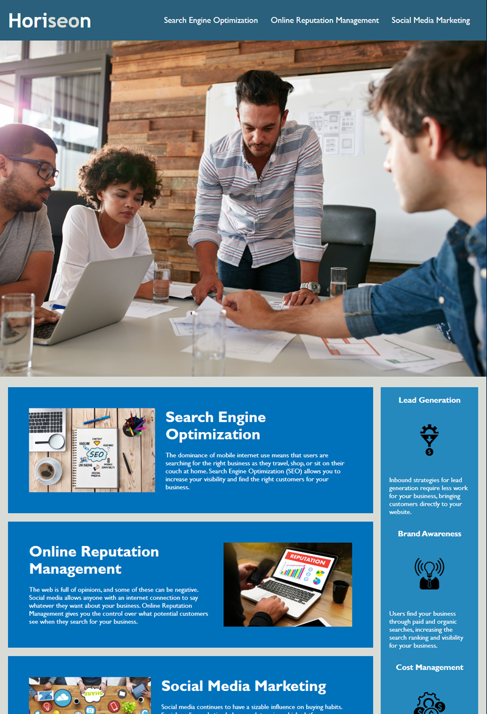

# Horiseon Social Solution Services, Inc

## Description
The goal of the Horiseon Social Solution Service, Inc project was to practice using semantic html and css to refactor a corporate webpage to make it more accessible. This refactoring included using semantic HTML elements, following a logical structure independent of styling and positioning, accessible alt attributes, heading attributes in sequential order, and a concise, descriptive title. Additionally, we want to follow the Scout Rule to always leave code cleaner than how we found it. So, I consolidated CSS selectors and their related html tags. 

## Screenshot

## Link
https://ms-meredith-mcd.github.io/semantic-html/